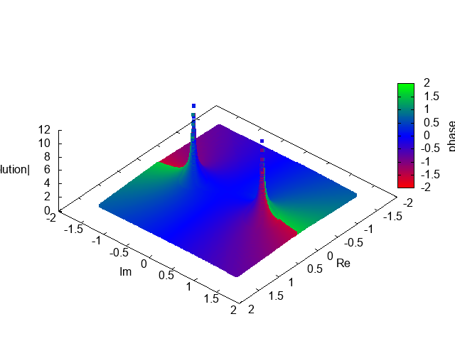

# ComplexPlaneMultithreadODEIntegrator
Software for integrating ODEs in the complex plane using POSIX threads.

Use it at your own risk.

For detailed description see:

Kycia R.A. (2014) Scheme for Numerical Investigation of Movable Singularities of the Complex Valued Solutions of Ordinary Differential Equations. In: Gerdt V.P., Koepf W., Seiler W.M., Vorozhtsov E.V. (eds) Computer Algebra in Scientific Computing. CASC 2014. Lecture Notes in Computer Science, vol 8660. Springer, Cham. https://doi.org/10.1007/978-3-319-10515-4_21

